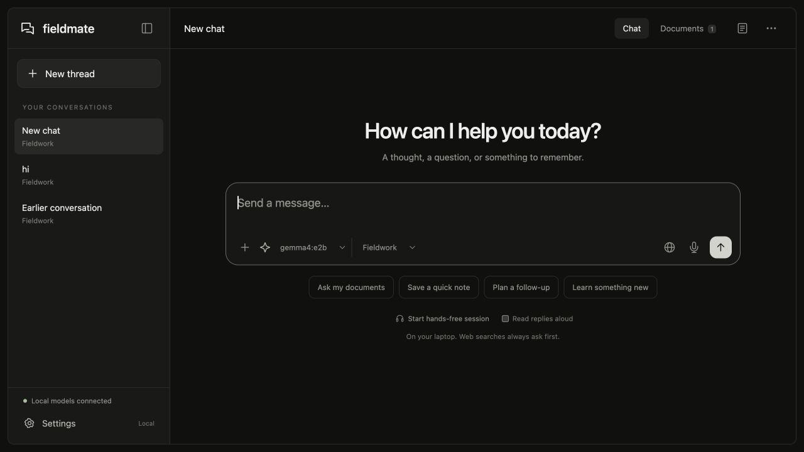

# Field Assistant

[](LICENSE)
[](pyproject.toml)

**Fieldmate** is a local AI voice assistant for working with your documents, keeping conversational context, and capturing notes and tasks. It runs on your laptop using Ollama and locally stored speech models. After setup, the core workflow works offline; internet search is optional and requires approval.

Built for a friend who works as a nurse, and adaptable to other document-based workflows through subject categories and custom instructions.

[Watch the demo](https://www.youtube.com/watch?v=TdKoUk4hte0) · [Report an issue](https://github.com/godlykmathews/Field-Assistant/issues) · [MIT license](LICENSE)



## Contents

- [Features](#features)
- [Requirements](#requirements)
- [Installation](#installation)
- [Usage](#usage)
- [Configuration](#configuration)
- [Architecture](#architecture)
- [Privacy and limitations](#privacy-and-limitations)
- [Development](#development)
- [Contributing](#contributing)
- [Troubleshooting](#troubleshooting)
- [Documentation and acknowledgments](#documentation-and-acknowledgments)
- [License](#license)

## Features

- **Local inference:** use compatible installed Ollama models, including Qwen and Gemma.
- **Document retrieval:** import text PDFs, Markdown, and UTF-8 text files; inspect sources and page references.
- **Persistent conversations:** create, rename, close, and reopen separate chat threads with their own context.
- **Subject categories:** organize documents and instructions by topic, with shared documents available across categories.
- **Contextual notes and tasks:** capture new observations or save content already discussed in the current thread.
- **Local voice:** speech recognition with faster-whisper and speech synthesis with Piper; push-to-talk and hands-free turn-taking.
- **Clarification:** combine optional Laya decisions with structured Ollama planning to handle missing information.
- **Approved web search:** review and edit each proposed query before it is sent to DuckDuckGo.
- **Notebook export:** export notes and tasks as JSON.

## Requirements

- [Ollama](https://ollama.com/) installed and running locally.
- [uv](https://docs.astral.sh/uv/) for Python environment and dependency management.
- Python **3.12 or 3.13**. The installation command below lets uv provision Python 3.12.
- Git and a modern browser. Voice input requires microphone permission.
- Enough memory and disk space for your selected models; requirements depend on model size.
- Internet access for the initial dependency and model downloads.

The commands below use macOS/Linux shell paths. Development and local model validation have been performed on macOS.

## Installation

### 1. Clone the repository and install dependencies

```sh
git clone https://github.com/godlykmathews/Field-Assistant.git
cd Field-Assistant
uv sync --python 3.12 --locked
```

### 2. Download the language and embedding models

Start Ollama using its desktop application, or run `ollama serve` in a separate terminal. Then download the default models:

```sh
ollama pull qwen3:8b
ollama pull nomic-embed-text
```

To use Gemma instead, also download a compatible variant and select it in the application:

```sh
ollama pull gemma4:e2b
```

The interface lists installed local chat models. It does not download models automatically. Chat models must support Ollama chat and structured JSON output; embedding-only and cloud models cannot be used for conversations.

### 3. Set up optional voice and clarification models

For local speech recognition and synthesis:

```sh
./.venv/bin/python setup_voice.py
```

For the optional Laya clarification engine:

```sh
uv sync --locked --extra decision
./.venv/bin/python setup_decision.py
```

Without Laya, the application uses structured Ollama decisions. The current Laya setup script downloads its checkpoint to the repository's `data/models/` directory. If you configure a different data directory, copy that checkpoint into its `models/` directory.

### 4. Start Fieldmate

```sh
./.venv/bin/python -m fieldmate
```

The application opens at [http://127.0.0.1:8765](http://127.0.0.1:8765) and binds only to the local machine. On macOS, you can also double-click **Start Fieldmate.command** after installation.

To skip opening the browser or select another port:

```sh
./.venv/bin/python -m fieldmate --no-browser --port 8766
```

For offline use, start the existing virtual environment directly as shown above and keep Ollama running. Download all required models before disconnecting. Re-running `uv sync` or `uv run` may synchronize dependencies; include `--extra decision` when you want to retain the optional Laya packages.

## Usage

### Conversations and documents

1. Start a **New thread** and choose a category and model.
2. Open **Documents** to import reference material and assign it to a category or make it shared.
3. Ask a question, then continue with follow-ups such as “Explain that more simply.”
4. Open the source cards beneath a response to inspect supporting passages.

Use **Settings → Assistant** to change the default prompt, model, search preference, and clarification engine. Use **Settings → Categories** to add subjects or edit their instructions. The conversation menu provides thread-specific instructions and rename/close/reopen actions.

Changing a category or model retains the current conversation. Start a new thread when you want a separate context.

### Notes and tasks

Try these commands:

```text
Save a note: the east gate is locked.
Add a task: revisit tomorrow.
Save this as a note.
Save our study plan as a note.
Show my notes.
Show my tasks.
```

Contextual captures resolve against the current thread's stored transcript. Whole-content saves copy the original answer rather than generating it again. Missing or invalid references prompt clarification without creating an item.

The notebook button opens saved notes, task checkboxes, and JSON export. An optional site/project label in conversation settings organizes captures. Task dates do not schedule notifications.

### Voice and web search

- **Microphone:** record an utterance, transcribe locally, and review it before sending.
- **Hands-free session:** submit utterances after silence; listening pauses during processing and speech.
- **Read replies aloud:** play a locally generated Piper response.
- **Web search:** review the query and choose **Allow this search** or **Continue offline**. Each search requires its own approval. Select **Disabled — stay offline** to disable searches.

## Configuration

Environment variables seed the backend defaults:

| Variable | Default | Purpose |
|---|---|---|
| `FIELDMATE_MODEL` | `qwen3:8b` | Initial default chat model |
| `FIELDMATE_EMBED_MODEL` | `nomic-embed-text:latest` | Document embedding model |
| `FIELDMATE_DATA_DIR` | `data` | Local application data and downloaded speech/decision models |

For example:

```sh
FIELDMATE_MODEL=gemma4:e2b ./.venv/bin/python -m fieldmate
```

Saved UI preferences take precedence over the initial default chat model, and individual threads can select their own model. Ollama is accessed at `http://127.0.0.1:11434`.

Changing the chat model does not change the document index. Changing the embedding model requires reindexing documents; the current embedding adapter uses Nomic's query and document prefixes.

## Architecture

| Layer | Implementation |
|---|---|
| Interface | Local HTML, CSS, and JavaScript |
| API and orchestration | FastAPI with validated request and response schemas |
| Inference | Ollama chat and embedding APIs |
| Retrieval | pypdf/text extraction, overlapping passages, Nomic embeddings, cosine similarity with keyword ranking |
| Storage | SQLite transcripts, summaries, vectors, notebook items, and search permissions |
| Decisions | Optional Laya ambiguity hints and structured Ollama planning |
| Speech | faster-whisper transcription and Piper synthesis |
| Internet search | DDGS using DuckDuckGo after explicit approval |

Conversation memory and document retrieval are separate. The backend loads thread history, maintains a rolling summary of older exchanges, and retains the full transcript for later reference. Named captures can retrieve original messages outside the recent model context.

Document citations are checked against retrieved source IDs and verbatim excerpts. Note/task writes and request receipts share a transaction so retries with the same request ID do not create duplicates. Search permissions are enforced by the backend, tied to a thread and query, and consumed once.

```text
fieldmate/       Backend, model adapters, retrieval, capture, voice, and UI
tests/          Automated regression tests
scripts/        Real-model smoke checks
examples/       Fictional sample document for trying retrieval
docs/           Screenshots, validation reports, and design references
setup_voice.py  Explicit speech-model download
setup_decision.py  Explicit Laya checkpoint download
```

## Privacy and limitations

- Core inference, retrieval, and voice processing run locally after setup. UI assets and fonts are local. Optional search sends the approved query to DuckDuckGo; it does not automatically upload the conversation or documents.
- `data/fieldmate.sqlite3` stores conversations, extracted document text, vectors, notes, tasks, settings, and permissions. `data/models/` stores downloaded speech and decision models. The application does not encrypt this data. Stop the app before copying the entire data directory for a simple backup.
- PDF imports need extractable text; scanned PDFs require OCR first. Imports are limited to 20 MB, 300 PDF pages, and 2,000 extracted passages per document.
- Source matching verifies where a quotation came from, not whether an answer is correct. Models, summaries, source documents, and reference selection can be incomplete or wrong. Health-related categories are educational, not a clinical decision system.
- Voice uses turn-taking and cannot be interrupted by speaking over it. Noisy environments may affect silence detection. The included Piper voice is English.
- Web results are search snippets rather than complete pages. Search providers can fail or rate-limit requests.
- The prototype processes one assistant response at a time and is intended for local use.

## Development

Install development tools, retaining the optional decision engine if you use it:

```sh
uv sync --python 3.12 --locked --extra dev --extra decision
```

Run the automated checks:

```sh
./.venv/bin/python -m pytest -q
./.venv/bin/ruff check .
node --check fieldmate/static/app.js
```

Node.js is needed only for the JavaScript syntax check above, not to run the application.

The real-model smoke check requires Ollama with `qwen3:8b`, `gemma4:e2b`, and `nomic-embed-text`, plus downloaded voice models unless using `--skip-voice`:

```sh
./.venv/bin/python -m scripts.smoke_test --data-dir data --report /tmp/fieldmate-smoke.json
```

It uses a temporary database and rejects non-loopback connections made through Python sockets during the test. This is a process-level check, not a machine-wide network audit. Existing reports are available in [docs/validation-v2.md](docs/validation-v2.md) and [docs/validation-context-capture.md](docs/validation-context-capture.md).

## Contributing

Bug reports, documentation improvements, tests, and code contributions are welcome.

1. Open an issue describing the bug or proposed larger change.
2. Fork the repository and create a branch for your work.
3. Make a focused change and add regression coverage when behavior changes.
4. Run the relevant checks listed above.
5. Open a pull request explaining the change and how you verified it.

For bug reports, include your operating system, Python and Ollama versions, selected model, reproduction steps, and sanitized error output. Do not include private documents, recordings, conversation databases, credentials, or downloaded model files. Keep application data out of commits.

## Troubleshooting

| Problem | What to check |
|---|---|
| Ollama is unreachable | Start Ollama and confirm it is listening on `127.0.0.1:11434`. |
| A model is missing from the selector | Download it with `ollama pull`; use an installed local chat model that supports structured output. |
| Voice is unavailable | Run `setup_voice.py`, restart Fieldmate, and allow microphone access in the browser. |
| Laya is unavailable | Install the `decision` extra and run `setup_decision.py`; Ollama routing remains available as a fallback. |
| A PDF has no extractable text | Apply OCR first or import a text/Markdown version. |
| Responses take too long | Try a smaller compatible model and shorter requests. |
| Port 8765 is already in use | Close the other Fieldmate instance or start with `--port 8766`. |

## Documentation and acknowledgments

- [Third-party components and licenses](THIRD_PARTY.md)
- [Community research and design references](docs/community-research.md)
- [Fictional demo field guide](examples/demo-field-guide.md)
- [Planning session](https://dev.to/agent_sessions/planning-fieldmate-an-offline-voice-assistant-for-a-field-worker-fgfqpi)
- [Initial implementation session](https://dev.to/agent_sessions/building-fieldmate-offline-rag-voice-notes-and-tasks-with-ollama-r0zolb)
- [Contextual assistant implementation session](https://dev.to/agent_sessions/fieldmate-v2-contextual-local-assistant-categories-and-permission-gated-web-search-dd9xt4)

The DevRelay sessions are sanitized, curated build records rather than complete raw transcripts. Codex assisted with implementation, debugging, and documentation.

## License

Field Assistant's application source code is licensed under the **MIT License**. See [LICENSE](LICENSE) for the full license text.

Copyright © 2026 Fieldmate contributors.

Third-party software and model weights retain their own licenses; the project's MIT license does not replace them. See [THIRD_PARTY.md](THIRD_PARTY.md) for component references and model license information.
